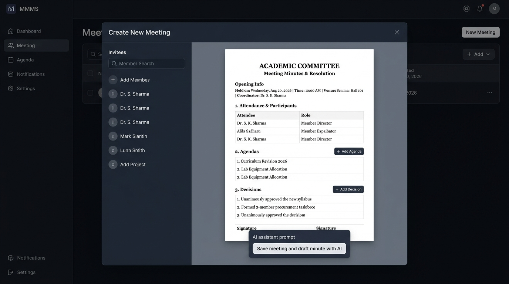

# Implementation Plan: Minute Template Editor Fix & Meeting Creation White Paper Canvas

## Visual Mockup

## 1. Overview & Objectives

This plan covers two key enhancements to the **Meeting Minute Management System (MMMS)**:

1. **Minute Template Editor Fix (No Blank Page):**
   - When a user navigates to a Committee and clicks **"Edit Minute Template"**, the editor must immediately load and display the **current saved minute template** (or the default committee template if not customized yet).
   - Users should never see a blank canvas or have to rewrite their template from scratch; they should always be able to directly edit their previous template.

2. **Interactive White Paper Document Canvas in Meeting Creation:**
   - In the Meeting Creation modal (`meeting-form.component`), replace the generic dark input boxes for Agendas and Decisions with a realistic, elegant **White Paper Document Canvas**.
   - The canvas renders the committee's template structure:
     - **Official Letterhead & Header:** Committee name, document subtitle (*"Meeting Minutes & Resolution"*), and formal typography.
     - **Live Meeting Metadata:** Meeting title, date, time, venue, and coordinator.
     - **Attendance & Participants Table:** Dynamically populated in real-time as invitees are selected in the left panel.
     - **Interactive Agendas Section:** Numbered editable rows (`1.`, `2.`, ...) with inline input, remove controls, and a `+ Add Agenda` button.
     - **Interactive Decisions Section:** Numbered editable rows (`1.`, `2.`, ...) with validation state, remove controls, and a `+ Add Decision` button.
     - **Document Footer & Signatures:** Formal sign-off lines.
   - Retain the **AI Minute Assistant** panel below the paper canvas for generating drafts with AI.

---

## 2. Technical Implementation Plan

### Part A: Minute Template Editor Pre-population Fix

#### Files to Modify:
- `memin-frontend/src/app/committee-details/minute-template/minute-template.component.html`
- `memin-frontend/src/app/committee-details/minute-template/minute-template.component.ts`

#### Key Changes:
1. **Reliable DOM Binding:**
   - In `minute-template.component.html`, bind `[innerHTML]="editorHtml"` directly on the `#editor` `contenteditable` container.
2. **Template Loading & Sync:**
   - In `minute-template.component.ts`, ensure `loadTemplate()` sets `this.editorHtml` with the committee's existing `minuteTemplateHtml` (or fallback preset if none exists) and updates `this.hasDataLoaded = true`.
   - Update `setEditorHtml()` to synchronize properly without relying solely on fragile `setTimeout` execution before the view child is rendered.
   - Maintain full support for tokens (`@committee`, `@date`, `@time`, `@location`, `@attendance`, `@agendas`, `@decisions`).

---

### Part B: Meeting Creation White Paper Document Canvas

#### Files to Modify:
- `memin-frontend/src/app/forms/meeting-form/meeting-form.component.html`
- `memin-frontend/src/app/forms/meeting-form/meeting-form.component.scss`
- `memin-frontend/src/app/forms/meeting-form/meeting-form.component.ts`

#### Key Changes:
1. **Meeting Form Structure (`meeting-form.component.html`):**
   - Retain top control bar for selecting Committee, Title, Date, Time, and Venue.
   - Wrap the main meeting content in a `.paper-document-sheet` container:
     - **Header Block:** Live dynamic rendering of Committee Name and Title.
     - **Metadata Block:** Live date, time, location, and coordinator info.
     - **Participants Table:** Live tabular view of `selectedInvitees`.
     - **Agendas Section:** Numbered rows with `[(ngModel)]="agenda.agenda"`, remove button, and `+ Add Agenda` action.
     - **Decisions Section:** Numbered rows with `[(ngModel)]="decision.decision"`, validation error messages, remove button, and `+ Add Decision` action.
     - **Signatures Section:** Sign-off placeholders for coordinator/secretary.
   - Position the **AI Draft Panel** and Save buttons beneath the document sheet.

2. **Styling & Aesthetics (`meeting-form.component.scss`):**
   - Style `.paper-document-sheet`:
     - Clean white background (`#ffffff` / `#fdfdfd`), crisp shadow `0 8px 28px rgba(0, 0, 0, 0.28)`, padding `48px 56px`, and serif typography (`Georgia`, `"Times New Roman"`, serif).
   - Style attendance table with clean borders (`#d0d7de`) and header highlight.
   - Style agenda and decision item rows:
     - Number badges (`1.`, `2.`, ...), clean document textareas, hover delete buttons.
     - Styled `+ Add Agenda` and `+ Add Decision` buttons tailored to the document theme.
   - Maintain responsiveness for both desktop and mobile viewports.

3. **Component Logic (`meeting-form.component.ts`):**
   - Ensure `agendas` and `decisions` arrays seamlessly bind to `MeetingCreationDto`.
   - Add helper formatters for dates/times on the document sheet.
   - Ensure local storage drafts and form validation errors operate smoothly.

---

## 3. Step-by-Step Verification Plan

1. **Verify Minute Template Editor:**
   - Navigate to a committee (e.g. Academic Committee) and click **"Edit Minute Template"**.
   - Verify that the previous saved template is immediately rendered in the editor (never a blank page).
   - Make edits, click **"Save template"**, navigate away and return to confirm edits persist.

2. **Verify Meeting Creation White Paper Canvas:**
   - Click **+ New Meeting** on a committee.
   - Verify the white paper document canvas renders with the committee header, date/time metadata, and attendance table.
   - Select members in the left panel and check that the attendance table updates dynamically.
   - Add/remove items in the Agendas and Decisions sections and verify numbering and validation.
   - Test saving the meeting and test **"Save meeting and draft minute with AI"**.
